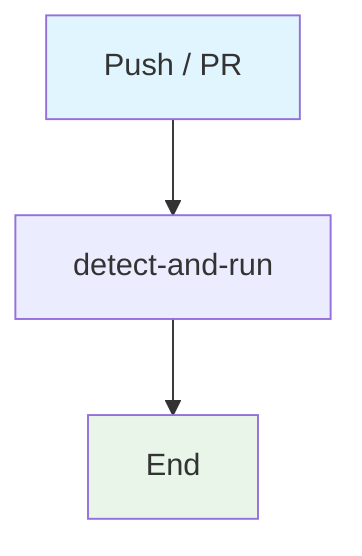

## Workflow Overview

**Purpose**: Fleet template detect-and-run CI. Detects Node or Python manifests and optionally installs/tests.
**Trigger Events**: Push to main/master; pull requests.
**Target Environments**: Ephemeral Ubuntu CI.

## Execution Flow Diagram

## Jobs & Dependencies

| Job Name | Purpose | Dependencies | Execution Context |
|---|---|---|---|
| detect-and-run | Optional install/test | none | ubuntu-latest |

## Requirements Matrix

| ID | Requirement | Priority | Acceptance Criteria |
|---|---|---|---|
| REQ-001 | Do not fail if tests are absent | Medium | Missing test script is a no-op |
| REQ-002 | No secrets in YAML | High | Workflow references no credentials |

## Notes

This is a copied fleet template. Do not treat it as a hard quality gate unless the repo has real tests.

## Change Management

| Version | Date | Changes | Author |
|---|---|---|---|
| 1.0 | 2026-08-23 | Initial specification | fleet audit |
